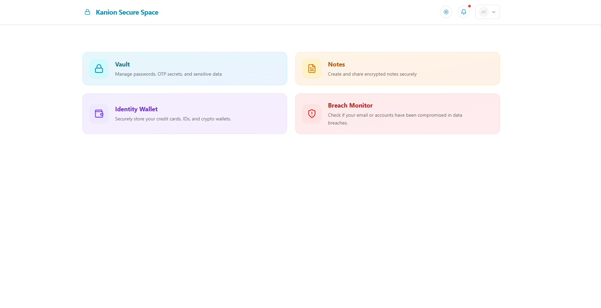
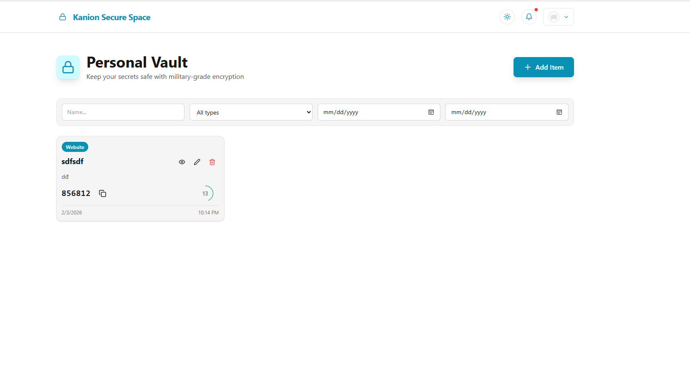
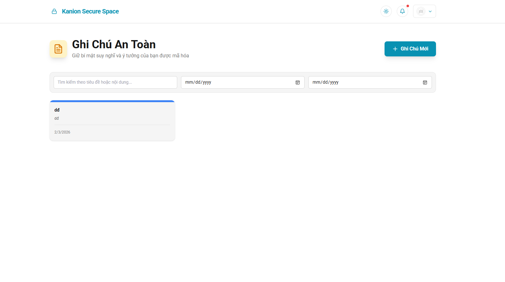
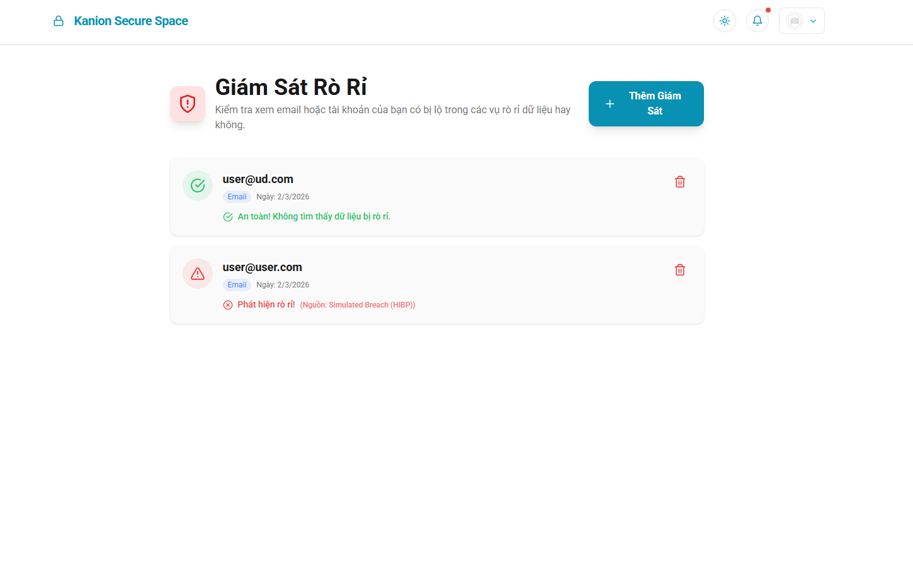

<div align="center">
   <h1>🔐 Kanion Secure Space</h1>
   <b>Nền tảng full-stack cho ghi chú bảo mật, kho mật khẩu và quản lý dữ liệu mã hóa</b>
   <br />
   <br />

</div>

---

## Tổng quan

**Kanion Secure Space** là một nền tảng mã nguồn mở quản lý mật khẩu và ghi chú mã hóa với chuẩn bảo mật cấp quân sự. Dự án được xây dựng bằng React 18, Node.js và PostgreSQL để lưu trữ an toàn mật khẩu, mã TOTP, ghi chú và dữ liệu cá nhân.

**Tính năng:**

- Mã hóa AES-256-GCM cho toàn bộ dữ liệu nhạy cảm
- Hỗ trợ TOTP 6 chữ số kèm đếm ngược theo thời gian thực
- Ghi chú mã hóa với màu tùy chỉnh
- Giao diện Dark/Light/Auto
- Hỗ trợ nhiều ngôn ngữ (Tiếng Anh, Tiếng Việt, ... - trong tương lai có thể mở rộng thêm)
- Thiết kế responsive ưu tiên màn di động
- Xác thực JWT kèm nhật

---

## Ảnh màn hình

<p align="center">
   
   
</p>
<p align="center">
   
   
</p>

---

## Công nghệ sử dụng

**Frontend:** React Vite

**Backend:** Node.js (v20+), Express.js

**CSDL:** PostgreSQL

**Công cụ:** pnpm • Docker • Docker Compose

---

## Cấu trúc dự án

```
Kanion_Platform/              # Monorepo
├── apps/
│   ├── backend/             # Express API (Cổng: 3000)
│   │   ├── src/
│   │   │   ├── routes/      # auth, vault, notes, user
│   │   │   ├── middleware/  # auth, rateLimit
│   │   │   ├── db/          # pool, migrate
│   │   │   └── utils/       # encryption, auditLog
│   │   └── sql/001_init.sql # Schema cơ sở dữ liệu
│   └── frontend/            # Ứng dụng React (Cổng: 5173)
│       └── src/
│           ├── pages/       # Login, Vault, Notes, v.v.
│           ├── components/  # NavBar, Theme, Toast
│           ├── api/         # client, notifications
│           └── locales/     # en.json, vi.json
├── pnpm-workspace.yaml
└── README.md
```

---

## Bắt đầu nhanh

### Yêu cầu trước chạy

- Node.js
- PostgreSQL 12+
- pnpm (hoặc npm)

### 1. Cài db

```bash
createdb kanion_db
psql -U postgres -d kanion_db -f apps/backend/sql/001_init.sql
```

### 2. Backend

```bash
cd apps/backend
cp .env.example .env        # Sửa theo cấu hình của bạn
pnpm install
pnpm run dev                # Chế độ phát triển
# pnpm start               # Chế độ production
```

### 3. Frontend

```bash
cd apps/frontend
cp .env.example .env        # Sửa URL backend
pnpm install
pnpm run dev                # Dev server: http://localhost:5173
```

### Truy cập

- Frontend: http://localhost:5173
- Backend: http://localhost:3000

---

## Tính năng bảo mật

- **Mã hóa:** AES-256-GCM cho toàn bộ dữ liệu nhạy cảm
- **Xác thực:** Token JWT 
- **Bảo mật mật khẩu:** Băm bằng Bcrypt (12 rounds)
- **Giới hạn tần suất:** 10 request/15 phút cho mỗi IP
- **Nhật ký:** Log đăng nhập, theo dõi thiết bị, sự kiện bảo mật
- **Security headers:** CORS, CSP, X-Frame-Options

---

## Build cho production

### Backend

```bash
cd apps/backend
pnpm install --production
pnpm start
```

### Frontend

```bash
cd apps/frontend
pnpm run build
# Output: dist/ → Deploy lên Vercel, Netlify, v.v.
```

---

## Triển kha

### Điều kiện quyết đinh

- Node.js v20 LTS
- Cơ sở dữ liệu PostgreSQL
- Có `pnpm-workspace.yaml` ở thư mục gốc (đã có sẵn)

### Backend

```bash
# Build: pnpm install
# Start: cd apps/backend && npm start
```

### Frontend

```bash
# Build: cd apps/frontend && pnpm install && npm run build
# Publish Directory: apps/frontend/dist
```

### Biến môi trường (Backend)

```env
PORT=3000
NODE_ENV=production
DATABASE_URL=your_postgresql_url
DB_SSL=true
JWT_SECRET=your_jwt_secret
ENCRYPTION_KEY=your_encryption_key
HIBP_API_KEY=your_hibp_api_key_optional
FRONTEND_URL=https://your-frontend-url.com
BACKEND_URL=https://your-backend-url.com
RUN_MIGRATIONS=true

# Optional SMTP
# SMTP_HOST=smtp.example.com
# SMTP_PORT=587
# SMTP_USER=your@email.com
# SMTP_PASS=yourpassword
# SMTP_FROM=no-reply@example.com
```

**Xử lý vấn đề:**

- Lỗi: "Cannot find package 'express'" → Đảm bảo đã commit `pnpm-lock.yaml`
- Lỗi: "ERR_INVALID_THIS" → Cập nhật Node.js lên v20 LTS
- Hướng dẫn triển khai chi tiết: [DEPLOYMENT.md](docs/DEPLOYMENT.md)

---

## Deploy Render (Root Dockerfile)

- Dự án dùng 1 Web Service chạy bằng `Dockerfile` ở thư mục gốc.
- Frontend được build và phục vụ qua backend/public trong cùng service.
- Đã có sẵn blueprint: `render.yaml` ở thư mục gốc.

### Biến môi trường cần đặt trên Render

- `DATABASE_URL`: URL PostgreSQL production (khuyến nghị endpoint IPv4/pooler)
- `JWT_SECRET`: secret cho token
- `FRONTEND_URL`: URL frontend được phép gọi API (CORS)
- `BACKEND_URL`: URL public backend (ví dụ `https://kanion-app.onrender.com`)

---

## API Endpoints

**Auth:** `POST /auth/register`, `POST /auth/login`, `GET /auth/logout`

**Vault:** `GET/POST /vault/items`, `GET/PUT/DELETE /vault/items/:id`

**Notes:** `GET/POST /notes`, `PUT/DELETE /notes/:id`

**User:** `GET/PUT /user/profile`, `GET/PUT /user/appearance-settings`

---

## Custom

- **Ngôn ngữ:** Thêm file dịch ngôn ngữ tại `frontend/src/locales/[lang].json` (file ngôn ngữ đọc dựa trên json)
- **Giao diện:** Chỉnh sửa `frontend/src/themeColors.js`
- **Loại mục Vault:** Cập nhật enum trong `001_init.sql`

---

## 📄 Giấy phép

MIT License - Xem file [LICENSE](LICENSE)
